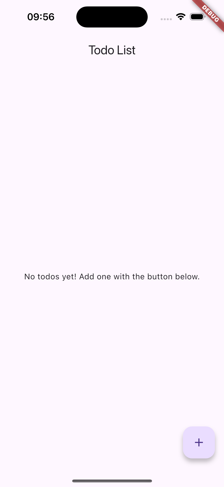
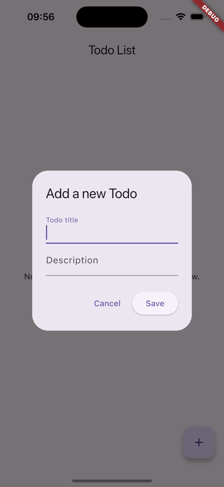
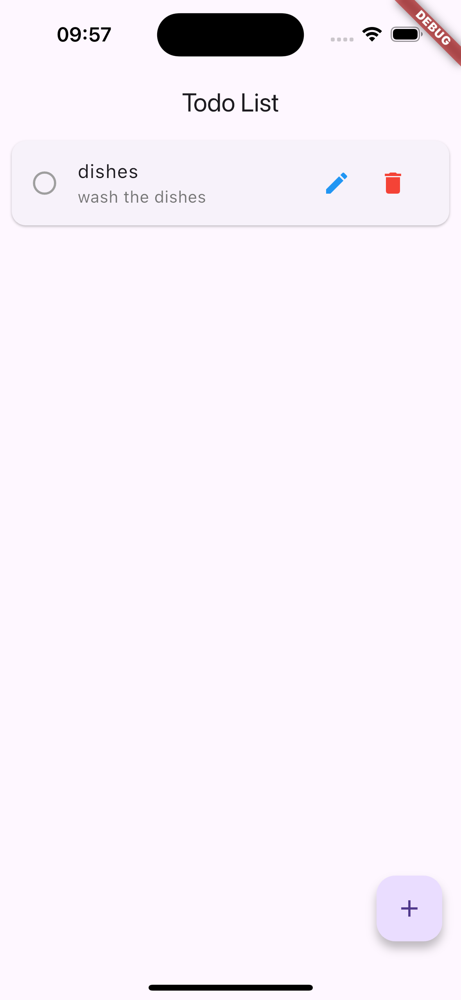

# 🛡️ Flutter Encrypted Todo App

A modern, secure, and internationalized to-do list built with Flutter. This app uses a Clean Architecture approach with the **Model-View-Intent (MVI)** pattern, powered by **Riverpod** for state management and **SQLCipher** for encrypted data storage.

---

## ✨ Features

* ✅ **Full CRUD Functionality**
  Create, read, update, and delete your to-do tasks seamlessly.

* 🔐 **Encrypted Local Storage**
  All data is securely stored using an encrypted SQLite database (via `sqflite_sqlcipher`).

* 🌍 **Internationalization (i18n)**
  Supports **English**, **Spanish**, and **Portuguese** out of the box.

* 🧱 **Clean & Scalable Architecture**
  Follows a layered architecture: **Data**, **Domain**, and **Presentation**.

* 🗝️ **Secure Key Storage**
  Encryption keys are stored using platform-secure storage mechanisms:

  * iOS: Keychain
  * Android: Keystore

---

## 📁 Project Structure

```bash
├── data
│   ├── models
│   │   └── todo.dart
│   └── services
│       └── todo_database.dart
├── domain
│   ├── intents
│   │   └── todo_intent.dart
│   ├── state
│   │   └── todo_state.dart
│   └── view_models
│       └── todo_view_model.dart
├── l10n
│   ├── app_localizations_en.dart
│   ├── app_localizations_es.dart
│   ├── app_localizations_pt.dart
│   ├── app_localizations.dart
│   ├── int_pt.arb
│   ├── intl_en.arb
│   └── intl_es.arb
├── main.dart
└── presentation
    └── todo_list_screen.dart
```

This structure reflects a Clean Architecture separation:

* `data/`: Low-level data sources and models.
* `domain/`: Business logic, UI state, and user intents.
* `presentation/`: UI layer with screens and components.
* `l10n/`: Localization files and generated code.
* `main.dart`: Application entry point.

---

## 🏗️ Architectural Overview

This project is based on **Clean Architecture** with a unidirectional **MVI pattern**:

### 📦 Data Layer

* Handles data sources and database interactions.
* Uses:

  * `sqflite_sqlcipher` for encrypted SQLite storage.
  * `flutter_secure_storage` for storing the encryption key.

### 🧠 Domain Layer

* Contains business logic and models.
* Includes:

  * `Todo` model.
  * `TodoViewModel`: handles user actions (**Intents**).
  * `TodoState`: represents the current UI state.

### 🎨 Presentation Layer

* Contains all UI components.
* `TodoListScreen`: dispatches user **Intents** and listens to state changes to rebuild the UI reactively.

---

## 🚀 Getting Started

### ✅ Prerequisites

Ensure you have the **Flutter SDK** installed. Then, add the following to your `pubspec.yaml`:

```yaml
dependencies:
  flutter:
    sdk: flutter
  sqflite_sqlcipher: ^2.3.2
  path_provider: ^2.1.2
  path: ^1.8.3
  flutter_riverpod: ^2.5.1
  flutter_localizations:
    sdk: flutter
  intl: ^0.18.1
  flutter_secure_storage: ^9.0.0
  hive_flutter: ^1.1.0

dev_dependencies:
  flutter_test:
    sdk: flutter
  flutter_lints: ^2.0.0
  custom_lint: ^0.5.8
  build_runner: ^2.4.8
```

Install the dependencies:

```bash
flutter pub get
```

---

## ▶️ Running the App

1. Generate localization code:

   ```bash
   flutter gen-l10n
   ```

2. Launch on a device or emulator:

   ```bash
   flutter run
   ```

---
## **Screenshots** 📸

Home | Add | List
:---:|:---:|:---:
 |  | 


## 🛡️ Development & Security Notes

* On **first launch**, the app logs the **randomly generated encryption key** to the console. This is useful for debugging with tools like [DB Browser for SQLite](https://sqlitebrowser.org/).

  Example:

  ```
  flutter: Database path: /Users/your_user/.../todo_database.db
  flutter: Database password: <securely-generated-password>
  ```

* To **force generation of a new encryption key**, tap the **Clear Secure Storage** icon in the app bar. This resets secure storage.

---


## 📄 License

This project is licensed under the MIT License.

